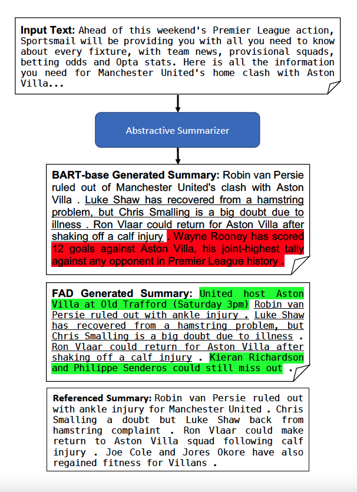

## Introduction
This is the course project for [EECS 487 Intro to Natural Language Processing](https://web.eecs.umich.edu/~wangluxy/courses/eecs487_wn2022/eecs487_wn2022.html)(NLP) and my first project about NLP, conducted with Zixuan Pan and Jiarui Liu. "Fad" as our project name is, my interest in NLP is not :)
## Demo
Please refer to the paper for detailed methodology, experiments, results and analysis. For a quick demo here, compared to the base line model (BART-base), FAD managed to sift out unimportant info and generate more abstractive and concise summaries.

