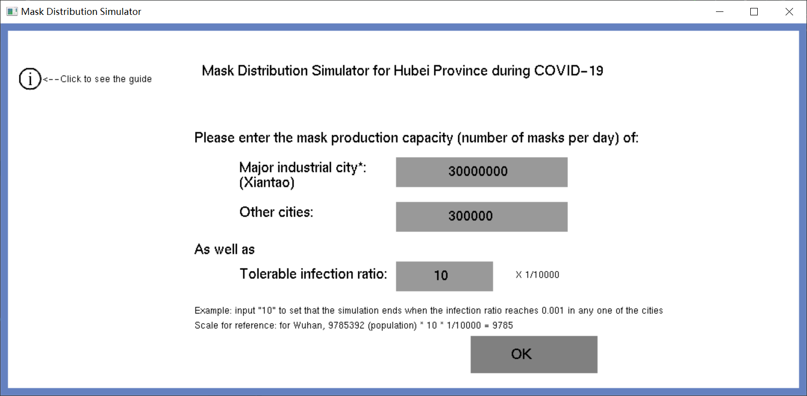
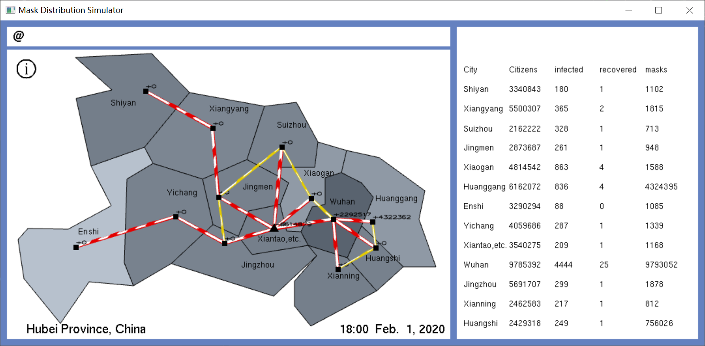

## Introduction
This is the course project for VG 101 Introduction to Programming conducted with Chenhao Zheng. It is actually **my first CS project**.

Th motivation of this project is the disastrous COVID-19 spreading all around the world at that time. Due to its sudden strike, the shortage of medical resources, such as masks, inevitably occurred. To slow down the spreading of COVID-19, tons of masks from all over the country and the world should be transported to the cities in need. However, it is tricky to plan the mask distribution and estimate the real-life outcome, e.g. the Red Cross’ redistribution of mask in Wuhan causing discontentment among citizens in Hubei Province.

## Design
### UIs

When staring the program, the input user interface will poop up:

Users will be asked to input mask production capacities for two type of city (Major industrial ciy, i.e. Xiantao and other cities in Hubei Province) and the tolerable infection ratio. Users can click corresponding blocks and type they choices in. After giving their input, users can go to the next interface by clicking the "OK" button. If users have any problems, they can click the "i" (information) button to find some guide.

        

This interface is mainly composed of three fields:

- Message box (upper-left). When the simulation ends, it will print out the ending message as well as the reason of ending (Which city exceeds the threshold or there is no infection case in Hubei) 

- Map of Hubei (left). The map is scaled based on the reality (size, shape) with different colors indicating the seriousness of infection in each city (the darker the color, the higher the infection rate). 

  There are two type of roads among these cities. The red roads all originate from Xiantao City (major production city) and are used (with animation) when there are transportations of masks (massive amount) from Xiantao to respective cities every 6 hours. The yellow roads covers two regions in Hubei Province and are used (with animation) when there are transportations of masks (small amount) within these regions every 2 hours. The number of transportations (export of import) are shown alongside the roads.

- data list (right). This list shows 4 significant values (total number of citizens, infection number, recovered number, mask number) of all the cities in Hubei Province.

With time, the components on this interface change (time, the colors of cities, the animation of roads, data in the data list) as the simulation goes on.

Users can also click the "i" button to see the guide, and moreover, they can click the city on the map to see the trending of infection in that city.

### Maths
#### Revised SIR model

The model we chose for the simulation of masks interacting with infection numbers is [the SIR model](https://scipython.com/book/chapter-8-scipy/additional-examples/the-sir-epidemic-model/).

In SIR model, three groups of people are divided for a pandemic:

- People susceptible but not yet infected, the number of whom is denoted as $S(t)$;

- Infectious/infected individuals, the number of whom is denoted as $I(t)$;

- Individuals who have recovered from the disease and now have immunity, the number of whom is denoted as $R(t)$;

with the differential equation describing how their change:
$$
\begin{aligned}

\frac{dS}{dt}&=-\frac{\beta SI}{N},\\

\frac{dI}{dt}&=\frac{\beta SI}{N}-\gamma I,\\

\frac{dR}{dt}&=\gamma I,

\end{aligned}
$$
where $\beta$ is a parameter describing the effective contact rate of the disease; $\gamma$ is a parameter describing the mean recovery rate (1/average_recover_days); $N$ is​ the total number of citizens in a city.

We set up the SIR model for every city in Hubei Province and the change of $S$, $I$, $R$ can be achieved with iteration as long as $dt$ is small enough and the [initial conditions](http://www.mnw.cn/news/shehui/2245524.html) are provided.

The important thing need to be addressed is how to describe parameters $\beta$ and $\gamma$, which should consider the influence of masks and other determinants in reality:

- The effective contact rate $\beta$:

  Inspired by the in-class question in Matlab part - "the possibility of a point falling into a circle in a region", we treat each person as a point who randomly falls in the city, either in "infectious/contacting area" or in "safe area". Initially, there were no person in a city (just an assumption) and all the area will be the safe ("infectious area" is zero). Then we can put each person into the city. starting from from the first person, the infectious area grows with an increment of a 3m-radius circle (the potential risk each person brings). For each person, the possibility that he/she might get infected can be approximated as the infectious area before he/she is put into consideration divided by the  total area. By adding the possibility of all people and divide it with the number of people, we can get the average contact rate.

  Of course the masks will reduce the effective contact rate. We chose to directly subtract the number of people by the mask number and calculate the remaining people. Moreover, since in reality, the only group of people that might get infected is the susceptible (infected and recovered can be infected again), the people we discussed before are directly the susceptible.

  Overall, the parameter $\gamma$ can be expressed as:
  $$
  \beta=k\cdot \frac{\frac{0}{\text{total}\_\text{area}}3^2\pi+\frac{1}{\text{total}\_\text{area}}3^2\pi+\cdots+\frac{\text{susceptible}\_\text{num}-\text{mask}\_\text{num}}{\text{total}\_\text{area}}3^2\pi}{\text{sus}\_\text{num}}\\
  =\frac{1+\text{susceptible}\_\text{num}-\text{mask}\_\text{num}}{\text{total}\_\text{area}}\cdot 3^2\pi
  $$
  (k is parameter of adjustment, which is canceled with $sus\_num$ in the denominator)

- The mean recovery rate $\gamma$:

  The average cure period for COVID-19 is [15 days](http://ask.39.net/question/66075613.html), so $\gamma$ should be around $\frac{1}{15}$. However, when there are too many patient, the lack of medical resources will make the average cure period longer. Therefore, considering the medical resources compared with the infected number, we set:

  - if $\text{num}\_\text{hospital}*\text{maximum}\_\text{hospital}\_\text{capacity}>=\text{infected}\_\text{num}$, $\gamma=\frac{1}{15}$.

  - if $\text{num}\_\text{hospital}*\text{maximum}\_\text{hospital}\_\text{capacity}<\text{infected}\_\text{num}$,
    $$
    \gamma=\frac{1}{15+15(1-e^{-\frac{\text{infected}\_\text{num} - \text{hspt}\_\text{capacity} \cdot \text{hspt}\_\text{num}}{ \text{hspt}\_\text{capacity} * \text{hspt}\_\text{num}}})}
    $$

  Moreover, at the beginning of the COVID-19, the effectiveness of medical treatment are low due to the outburst of pandemic and the panic, so $\gamma$ can be described in this case as:
  $$
  \gamma=\frac{\text{time}\_\text{from}\_\text{start}}{10[\text{days}]}\cdot\frac{1}{15};
  $$

#### Mask Number Model
We also considered effect of mask numbers of different cities. The number of masks is changed from three perspectives: the daily consumption of citizens (decrease) , self production (increase), transportation between cities (increase for non-major cities, decrease for major cities).

- For the daily consumption, we calculate the required mask number for a day: 
$$
\text{req}\_\text{msk}\_\text{num}=\text{mask}\_\text{use}\_\text{rate}\cdot(1\cdot \text{susceptible}\_\text{num}+2\cdot \text{infected}\_\text{num}+0.5\cdot \text{recovered}\_\text{num})
$$
describing the ratio of people going outdoors which decrease with the time (due to the increase of awareness of COVID-19 for citizens). In each iteration, we subtract the required mask number of every $dt$ from the current mask number.

- Likewise, for the daily consumption, likewise, we just add the mask production capacity (see the "feature part") times $dt$ to the current mask number.

- There are two type of transportation, i.e. transportation between major industrial city and each non-major city and transportation within two small regions.

  For the first kind, we first find the order of urgency (the greater $\frac{dI}{dt}$, the more urgent) of all cities (including the major). Masks will be transported following this order. For cities whose orders are before the major city's (more urgent), masks will be transported there as long as the remaining mask number of major city is greater than 0, the number of transported masks as large as possible; for cities whose orders are after the major city's, the transportation will happen if there will be masks more than the required number (calculated previously) in the major city after the transportation, the number of transported masks as much as possible.

  

With all these differential equations, the description of parameters as well as the change of mask numbers for each city, we can simulate how the COVID-19 infection situation goes generally in Hubei Province by numerous iteration. 

## Progress
  |   Time    |                        Task finished                         |
  | :-------: | :----------------------------------------------------------: |
  |   7.14    |           The main simulation algorithm be created           |
  |   7.17    | Map and basic animation has been generated, the user interface be initialized |
  |   7.20    | The simulation functions (distribution of mask, infection progress...) be created |
  | 7.20-7.27 |                  Complete the expected-line                  |
  |   7.31    | The data and map is successfully imported from the real condition in HuBei |
  |  8.1-8.7  | After meeting with the professor, we revise the project according to professor's suggestion |