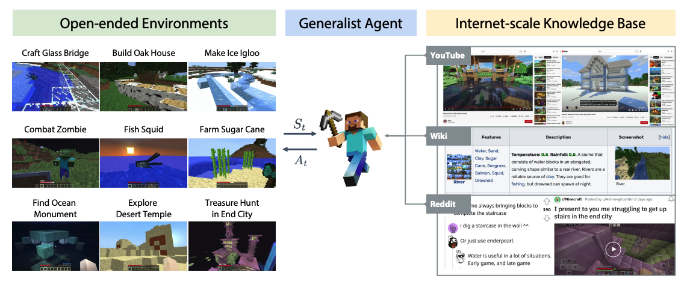

Advisor: [Dr. Jim Fan](https://jimfan.me/)

## Introduction

**MineDojo** is a new framework built on the popular [Minecraft](https://en.wikipedia.org/wiki/Minecraft) game for embodied agent research, featuring:
- a simulation suite with 1000s of open-ended, language-prompted tasks and a procedurally generated world with versatile observation space for AI agents to freely explore.
- a massive internet-scale knowledge base constructed with YouTube videos, Wiki pages, and Reddit posts.
- a video-language contrastive model - MineCLIP - that associates videos and the text of various tasks, serving as the reward function.

## Contributions & Reflections

My work in Jim-Team are highly tasks-oriented. My contributions are three-fold:
- Enable GPU acceleration for scalable MineDojo RL simulation on headless machines.
  > When tackling a problem which we don't have expertise in, it would beneficial to take a holistic to get a sense of possible directions with their feasibilities, before digging into the technical part.
- Create a meta-dataset of 20 open-ended, task-oriented datasets.
  > The awesome list is helpful.
- Scrape web data, e.g. GitHub repos for front-end development frameworks, DALL-E-2 showcase
  - applying Scrapy, Selenium and BeautifulSoup.
