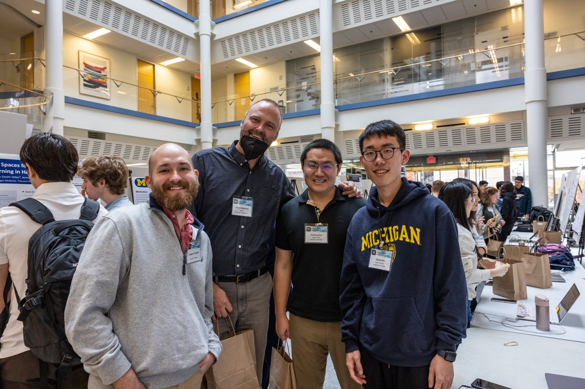
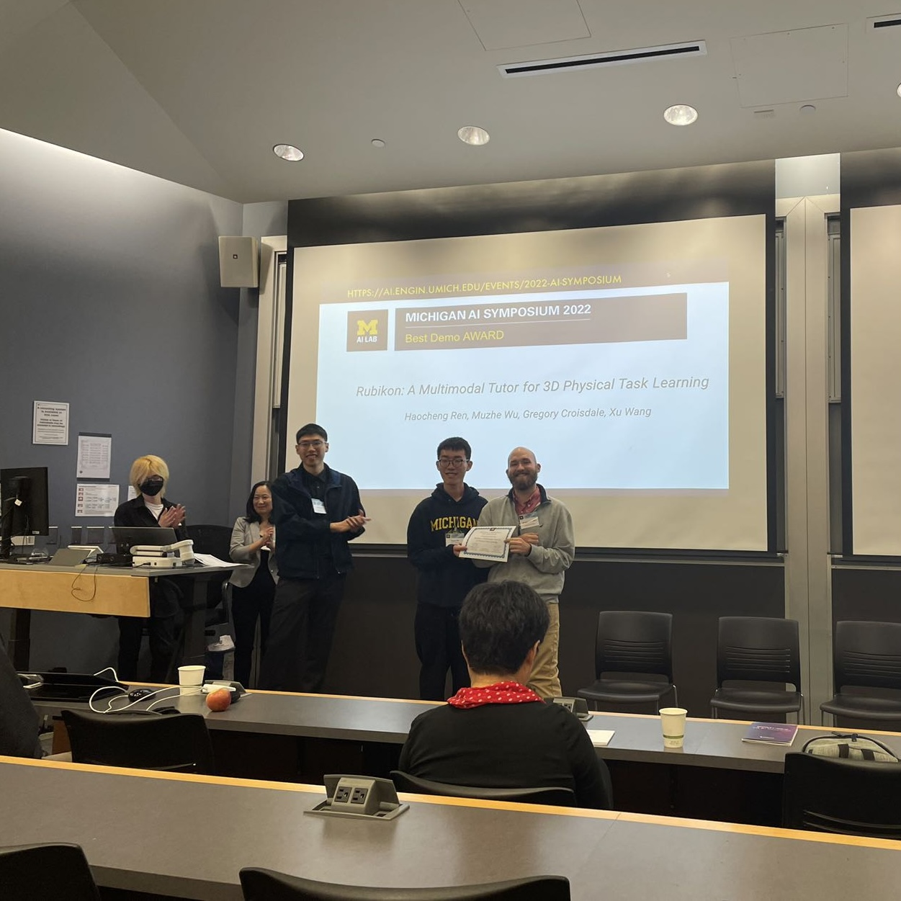

I had the chance to attend Michigan AI Symposium 2022 and present our work of [Multimodal Tutoring System](../research/mmtutor).

A group photo in front of our poster (Left to right: [Gregory Croisdale](https://gregory.croisdale.us/), [Prof. Jacob O. Wobbrock](http://faculty.washington.edu/wobbrock/), [Prof. Anhong Guo](https://guoanhong.com/), and me)

We won the Best Demo Award!