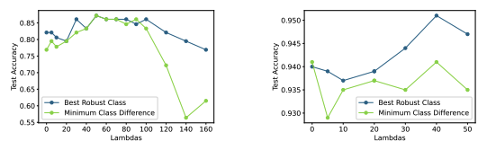
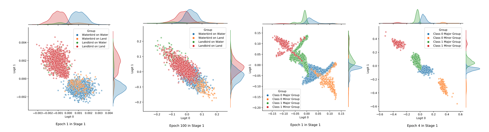

## Introduction
This is the course project for [EECS 598 Science of Deep Learning](https://docs.google.com/document/d/1u4llb2tjRb47wPBA4fEaHRxuvwDEwuUbs8vfBANVIy4/edit) and a follow-up work based on [[1]](#references), conducted with Jiarui Liu.

The spurious correlation is a phenomenon in machine learning where a model tends to “learn" certain decision rules based on spurious features such as backgrounds, thus likely to have unintended behaviors for subgroups from a data distribution. It prevails in various fields, including computer vision [[2]](#references)(e.g., a image classifier would decide on a waterbird based on the water background), natural language processing [[3]](#references), and reinforcement learning [[4]](#references). Due to the ubiquity and gravity of this problem, extensive efforts have been made to address it.

Prior work has proposed the **BAM algorithm**, which, in Stage 1, trains a bias-amplified model to bias toward majority group samples with **trainable auxiliary variables** [[5]](#references), and in Stage 2, upweights the misclassified samples and unbiases the model. (Please refer to the paper for details.) Despite the great performance BAM achieved in improving the worst group accuracy, why this algorithm works or how this
approach can be generalized to different settings remains unknown.

Therefore, we conducted this project to investigate different elements
in BAM and perform more experiments.

## Experiments
We further applied two datasets: **Controlled-Waterbirds** and **Colored-MNIST**, for which we were able to manipulate their class and group ratios. Based on these datasets, we conducted experiments with controlled variables of **strengths of auxiliary variables**, **ClassDiff**, **upweight factors**, and **stage one epoch number**, validated their effectiveness respectively. Please refer to our paper for details.

Some interesting visualization is provided as follows:

Test accuracy vs. the strengths of auxiliary variables

Class distribution vs. number of epochs for Stage 1 training

## References
1. Gaotang Li, Jiarui Liu, and Wei Hu. Bias amplification improves worst-group accuracy without group information. Artificial life, 26(2):274–306, 2020.
2. Sara Beery, Grant Van Horn, and Pietro Perona. Recognition in terra incognita. In Proceedings of the European conference on computer vision (ECCV), pages 456–473, 2018.
3. Suchin Gururangan, Swabha Swayamdipta, Omer Levy, Roy Schwartz, Samuel Bowman, and Noah A. Smith. Annotation artifacts in natural language inference data. In Proceedings of the 2018 Conference of the North American Chapter of the Association for Computational Linguistics: Human Language Technologies, Volume 2 (Short Papers), pages 107–112, New Orleans, Louisiana, June 2018. Association for Computational Linguistics.
4. Joel Lehman, Jeff Clune, Dusan Misevic, Christoph Adami, Lee Altenberg, Julie Beaulieu, Peter J Bentley, Samuel Bernard, Guillaume Beslon, David M Bryson, et al. The surprising creativity of digital evolution: A collection of anecdotes from the evolutionary computation and artificial life research communities. Artificial life, 26(2):274–306, 2020.
5. Wei Hu, Zhiyuan Li, and Dingli Yu. Simple and effective regularization methods for training on noisily labeled data with generalization guarantee. arXiv: Learning, 2020.