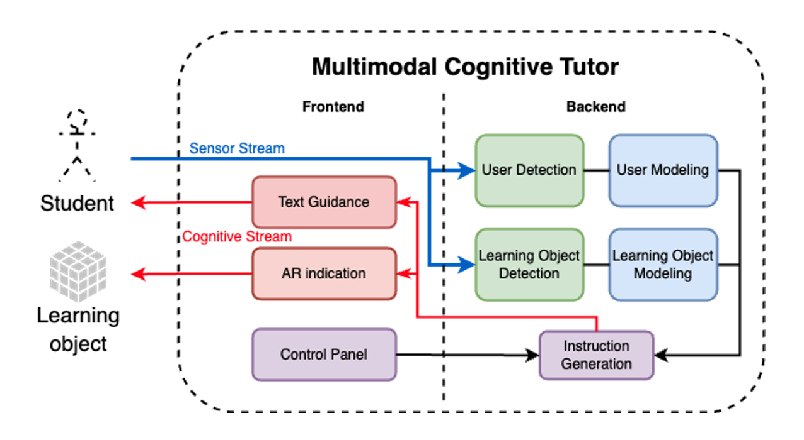
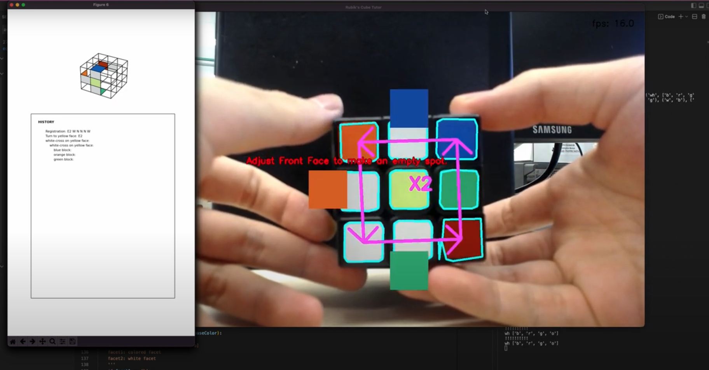
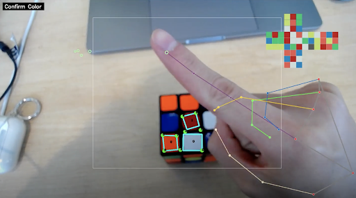

Advisors: [Prof. Xu Wang](https://web.eecs.umich.edu/~xwanghci/) and [Prof. Anhong Guo](https://guoanhong.com/)
> This is an ongoing project about the broad topic of the intelligent tutoring system (ITS) and there have been many interesting ideas popping up. Please stay tuned for updates.

## Introduction
Traditionally, self-learning of 3D physical tasks (e.g. playing basketball, assembly, etc.) relies on 2D static instructions, e.g. manuals and instruction videos, which
- Lack instant feedback / dynamic task generation
for knowledge enhancement
- Have high cognitive load for hidden information

The ITS is a potential approach to them. Nevertheless, challenges exist in
- Capturing learners’ behaviors in 3D space
- Preserving learning space & reality similarity

Consequently, we need a new ITS framework that copes with these issues...
## Framework
Here we provide the high-level diagram of our ITS framework. More design considerations will be disclosed in the future.

We specifically created the instance for the [Rubik's Cube](https://en.wikipedia.org/wiki/Rubik%27s_Cube). Here is a quick demo picture.

## Fundamentals
### ArUco Marker
ArUco Markers are really popular in XR applications. We later decided to apply them as they provide higher detection accuracy facilitating domain modeling (robust in different environments for their high contrast) and bigger design space for user feedback.

Please refer to [OpenCV library](https://docs.opencv.org/4.x/d5/dae/tutorial_aruco_detection.html) for their usage.

### MediaPipe Hand
> [MediaPipe](https://google.github.io/mediapipe/) offers cross-platform, customizable ML solutions for live and streaming media.

In our system, we applied MediaPipe [Hand](https://google.github.io/mediapipe/solutions/hands.html) for finger detection, facilitating user modeling.

### Presentation
We presented our work at [Michigan AI Symposium 2022](../posts/mi-ai-symposium-2022) and gratefully won the Best Demo Award.